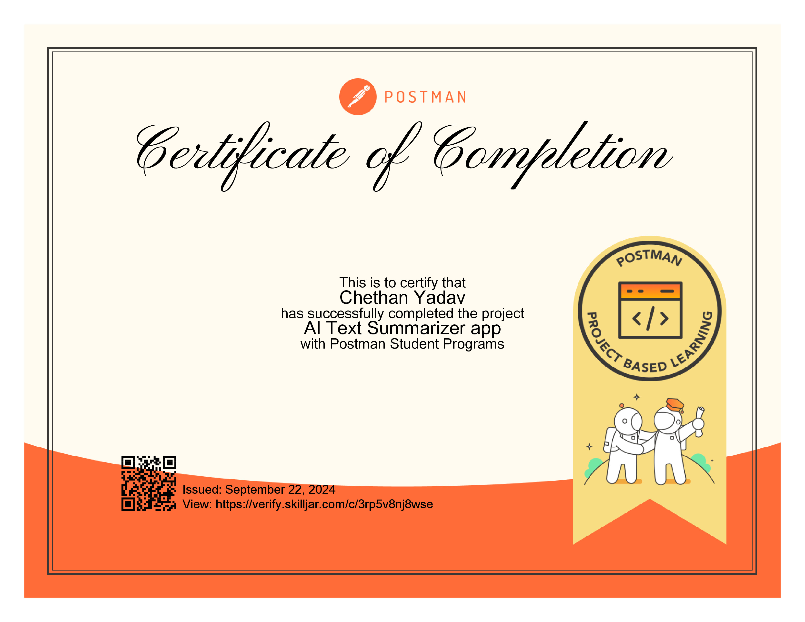

# AI TEXT SUMMARIZER APP

This is a simple AI text summarizer app that uses the Hugging Face Inference API to summarize text. The app is built using the Node.js, Express.js. The app uses the Hugging Face Inference API to generate the summaries. This project is part of the AI Text Summarizer App course on the [Postman Academy](https://academy.postman.com/project-ai-text-summarizer).

## Usage
To use the app, simply enter the text you want to summarize in the text box and click the "Summarize" button. The app will then generate a summary of the text.

## Installation
To install the required libraries, run the following command:
```bash
npm install
```

## Running the App
To run the app, use the following command:
```bash
 npm run start
```
## My Certificate
